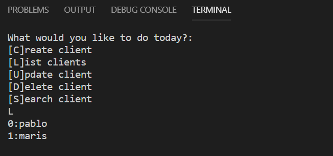

# Crud with python
## create, edit, delete, search with python

- Interface - How our software interacts with the exterior. In this case they are the commands

- Services - Business Logic

- Models - Abstraction of the objects with which we interact. In this case it is Client

